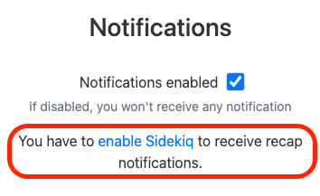

# Sidekiq Configuration

[Sidekiq](https://github.com/sidekiq/sidekiq) is a background job framework that enables you to schedule and run background tasks asynchronously and with retry mechanisms.

The most common background job performed in Astuto is sending emails. By default, Astuto saves emails to be sent in an in-memory queue, and then send them out asynchronously. The problem is that, since this email queue is saved in memory, if the Astuto container crashes or is restarted for whatever reason (e.g. update), then the queue is lost and queued emails will never be sent.

So, in this context, Sidekiq can be useful, because it makes use of [Redis](https://github.com/redis/redis) to persist the queue to the disk: so, emails will be sent even if the Astuto container goes down temporarily.

Moreover, Sidekiq can be used to schedule recurring jobs, similarly to cron. This feature is used by Astuto to enable administrators and moderators to receive the daily recap of received feedback (click on your profile picture, then "Profile settings", then check the "Notifications" section). This feature will not be available in your instance if you do not setup Sidekiq (see image below).



In order to integrate Sidekiq, we need to update the `docker-compose.yml` file to include also `redis` and `sidekiq` containers.

## Docker compose file

Here is an example `docker-compose.yml` file that includes all containers needed to make Sidekiq work:

```yml title="docker-compose.yml"
services:
  redis:
    image: redis:7
    environment: &redis-env
      REDIS_URL: redis://redis:6379/0
      REDIS_PASSWORD: redispassword
    command: ["/bin/sh", "-c", "redis-server --requirepass \"$${REDIS_PASSWORD}\""]
    ports:
      - "6379:6379"

  db:
    image: postgres:14.5
    environment: &db-env
      POSTGRES_USER: postgresusername
      POSTGRES_PASSWORD: postgrespassword
    volumes:
      - dbdata:/var/lib/postgresql/data

  web:
    image: riggraz/astuto:latest
    environment: &web-env
      <<: [*db-env, *redis-env]
      ACTIVE_JOB_BACKEND: sidekiq # This enables sidekiq
      BASE_URL: http://yourwebsite.com
      SECRET_KEY_BASE: yoursecretkeybase
    ports:
      - "3000:3000"
    depends_on:
      - redis
      - db

  sidekiq:
    image: riggraz/astuto:latest
    entrypoint: ["bundle", "exec", "sidekiq", "-q", "default", "-q", "mailers", "-e", "development"] # -e can be either "development" or "production"
    environment:
      <<: *web-env
      IS_SIDEKIQ: true
    depends_on:
      - redis
      - db

volumes:
  dbdata:
```

Basically, we need to run two different containers with the `astuto` image: the usual one, `web`, will run the webserver, the new one, `sidekiq`, will serve as a distinct process to run the sidekiq process. A few notes:

- In the sidekiq entrypoint command, use the correct environment (development or production)
- In the sidekiq service, note the `IS_SIDEKIQ` environment variable set to true. This is used internally to distinguish between the web and the sidekiq services.

## Disabling Sidekiq

If for any reason you want to disable Sidekiq, you can do so just by removing the environment variable `ACTIVE_JOB_BACKEND` or setting it to `async`. This will fallback to Rails default fallback queue handler. This may be useful to temporarely disable Sidekiq if it is not working as expected.