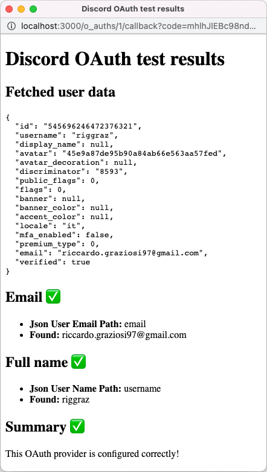

# OAuth Configuration Basics

This page offers an overview of the available settings for configuring custom OAuth providers. If you're completely new to OAuth, we suggest reading [this Digital Ocean tutorial](https://www.digitalocean.com/community/tutorials/an-introduction-to-oauth-2) first. If you're trying to configure a specific OAuth provider, check whether it's available in our list of guides for [common OAuth providers](common-oauth-providers.md).

## OAuth Configuration

You can create a new OAuth provider from "Site Settings > Authentication > New".

You need to fill the following fields:

- **Name**: the name of the OAuth provider
- **Logo** (optional): URL to the logo of the OAuth provider
- **Client ID**: the client ID issued by the OAuth provider upon registering your application
- **Client secret**: the client secret issued by the OAuth provider upon registering your application
- **Authorize URL**: URL to the OAuth provider authentication page
- **Token URL**: URL to the OAuth provider endpoint for retrieving the access token
- **Scopes**: space-separated list of the data you're requesting to the OAuth provider. In order for Astuto to work, you need to provide at least the email scope, whereas the name scope is optional but recommended.
- **Profile URL**: URL to the OAuth provider endpoint from which to retrieve profile information
- **JSON path to user email**: the path needed to extract the email from the JSON returned by the OAuth provider
- **JSON path to user name** (optional): the path needed to extract the name from the JSON returned by the OAuth provider

## How To Configure JSON Paths

Suppose the OAuth provider returns this JSON structure:

```json
{
  "user_profile": {
    "full_name": "Name Surname",
    "age": 28,
    "emails": [
      "email1@test.com",
      "email2@test.com"
    ]
  }
}
```

The fields **JSON path to user email** and **JSON path to user name** explains to Astuto how to get the email and the name respectively.

In the example above, we should set **JSON path to user email** to `user_profile.emails[0]` in order to retrieve `email1@test.com`, and **JSON path to user name** to `user_profile.full_name` in order to retrieve `Name Surname`.

## Test Your OAuth Configuration {#oauth-test}

Before enabling your custom OAuth provider, be sure to test it to check if it works as expected. In order to test a OAuth provider, click the "Test" button from the "Site Settings > Authentication" page.

If your configuration is correct, the provider's login page will appear. Insert your credentials and log in to the OAuth provider. A summary page of the OAuth configuration will appear, showing the JSON returned by the OAuth provider and whether the email and name fields were correctly retrieved.

The following is an example of a correctly configured OAuth provider with Discord:



If both the email and the name are successfully found, then the OAuth is configured correctly.

:::danger Email is required

If the email cannot be retrieved, then the OAuth provider cannot be used to log in and its configuration must be fixed.

:::

:::info Name is optional

If the email is successfully found but the name is not, then the OAuth can be used to log in but users will have the name "Anonymous User".

:::

After you've tested that your OAuth configuration works as expected, remember to enable it from "Site Settings > Authentication".