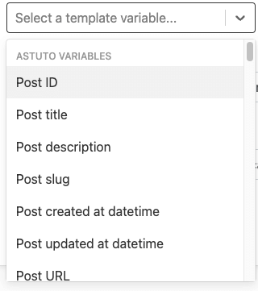
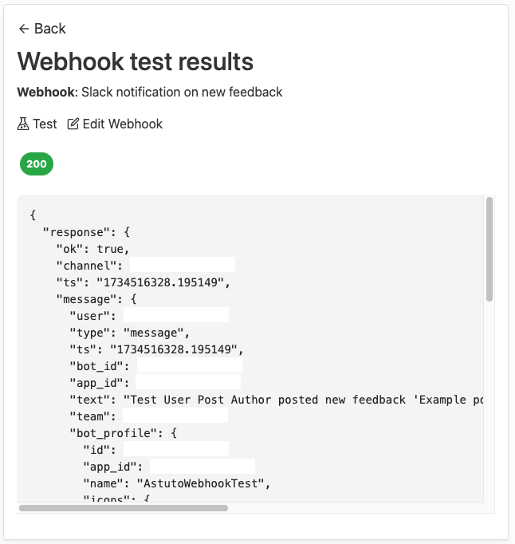

# Introduction to Webhooks

Webhooks are a simple yet powerful way to integrate Astuto with external tools like Jira, Trello, GitHub, Slack, etc.

In short, they enable you to make API requests to external tools whenever a certain action happens in your Astuto feedback space. Here are some examples:

- When a new feedback is submitted to Astuto, send a message to your Slack channel
- When a feedback changes status on Astuto, automatically move the corresponding Trello card to a new list
- When a user signs up on Astuto, make an API call to your backend server and perform some custom business logic

## How to create a webhook

You can create a new webhook from the page "Site settings > Webhooks", by clicking on the "New" button.

You need to fill the following fields:

- **Name**: the name of the webhook (must be unique)
- **Description**: optional description of what the webhook does
- **Trigger**: the action inside Astuto that will trigger the execution of the webhook
- **HTTP method**: the HTTP method used to perform the HTTP request
- **URL**: the URL to which the HTTP request will be sent (accepts [Liquid syntax](#liquid-syntax))
- **HTTP request body**: the HTTP body of the request (accepts [Liquid syntax](#liquid-syntax))
- **HTTP headers**: optional HTTP headers to include in the request (you can add more header by clicking on the "Add header" button)

When creating a webhook, you can preview the URL and HTTP request body that will be sent by clicking on the "Preview" button. This is useful to check if the Liquid syntax is correctly interpreted.

## Liquid syntax

Liquid is a simple templating language that allows you to insert dynamic content (i.e. Astuto entities like feedback title, user emails,) in your webhook URL and HTTP request body.

For example, you may want to send a message to Slack with the title of the newly created feedback and the email of the user who submitted it. The following syntax will do the trick:

```liquid
New feedback: {{ post.title }} submitted by {{ post_author.email }}
```

`{{ post.title }}` and `{{ post_author.email }}` will be replaced with the actual feedback title and user email when the webhook is triggered.

You can access the available variables for each trigger in the "Select a template variable..." dropdown, as shown in the following image:



Liquid also supports tags and filters, which can be used to manipulate the data before sending it to the external tool. You can find some of the available tags and filters in the "Select a template variable..." dropdown, but for a more comprehensive list, you should refer to the [official Liquid documentation](https://shopify.github.io/liquid/basics/introduction/).

:::info The escape_json filter
The `escape_json` filter is a custom Liquid filter defined by Astuto, so you won't find it in the Liquid documentation. However, it is really useful to escape feedback titles and descriptions: since they can contain double quotes (") and you usually send requests with JSON that also uses double quotes to enclose keys and values, this filter is essential to escape quotes and avoid any parsing errors. Take a look at [Common Webhooks](common-webhooks) page to see the `escape_json` filter in action.
:::

## Test your webhook

Before enabling your webhook, be sure to test it to check if it works as expected. In order to test a webhook, click the "Test" button from the "Site settings > Webhooks" page. A summary page of the webhook response will be shown, containing the HTTP status code and body of the response.

The following is an example of a correctly configured webhook:



If your configuration is correct, you may want to enable the webhook by clicking on the toggle "Enabled/Diabled" button in "Site settings > Webhooks".